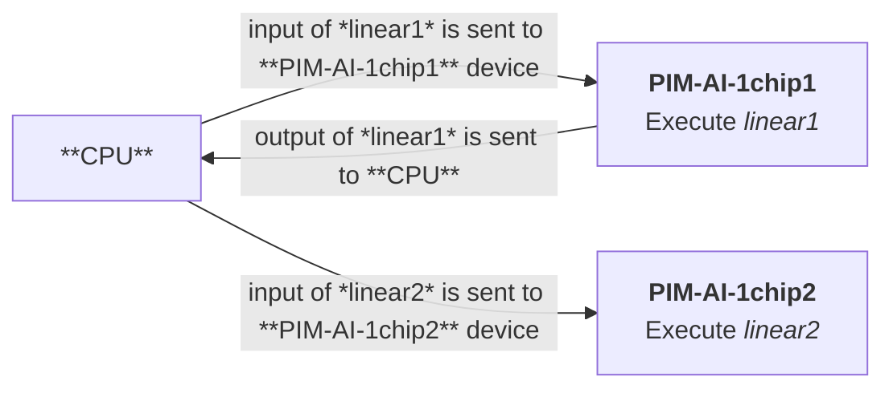

UPMEM LLM framework for profiling / simulation
==============================================

This library allows

1. Profiling PyTorch neural networks on a CPU,
2. Simulating the execution of the neural network in a target hardware accelerator.

Usage
-----

1. Import the `upmem_llm_framework` library and [`typer`](https://typer.tiangolo.com/). Create a `typer` app to handle the user input for the profiler.

    ```python
    # file: my_profiler.py
    import typer

    import upmem_llm_framework as upmem_layers

    app = typer.Typer(callback=upmem_layers.initialize_profiling_options)
    ```

2. Define your main function and add the desired user input.
  Initialize the library before creating or importing the neural network:

    ```python
    @app.command()
    def profile(my_input: str):
        upmem_layers.profiler_init()
        # Create or import the neural network
        model = ...
        # Define the input tensor
        myTensor = ...
    ```

3. Call the profiler when doing a forward pass / inference:

    ```python
        upmem_layers.profiler_start()
        prediction = model.forward(myTensor)
        upmem_layers.profiler_end()
    ```

4. Call the app:

    ```python
    if __name__ == "__main__":
        app()
    ```

5. See the available options:

    ```bash
    python my_profiler.py --help
    ```

6. Run the app:

    ```bash
    python my_profiler.py --some-option profile my_input
    ```

### Examples

You can find usage examples with a custom PyTorch model in `nn_example.py` and with a model from
HuggingFace in `hf_example.py`.

<details>
  <summary>PyTorch model</summary>

```bash
python3 nn_example.py profile
```

Expected output:

```text
Options: Options(report_layers=False, report_functions=False, print_log=False, print_log_summary=False, simulation=False, sim_compute=False, sim_data_type=<DataType.bfloat16: 'bfloat16'>, sim_num_key_value_heads=-1, sim_sliding_window=-1, sim_verbose=False, extra_archs=None)
The model:
TinyModel(
  (linear1): UPM_Linear(in_features=100, out_features=200, bias=True)
  (activation): ReLU()
  (linear2): UPM_Linear(in_features=200, out_features=10, bias=True)
)
##### UPMEM PROFILER OUTPUT #####
Total time (SUM + GEN): 0.002975238 s, with data type: bfloat16, batch size: 1
Generated tokens: 0 in 0.002175651 s, with tokens/s: 0.0
Summarization step took: 0.000799587 s, weight in the execution: SUM: 0.268747239716621%, GEN: 0.7312527602833789%
##### END UPMEM PROFILER OUTPUT #####
tensor([0.0983, 0.0919, 0.1012, 0.0836, 0.0796, 0.1157, 0.1202, 0.0996, 0.0930,
        0.1168], grad_fn=<SoftmaxBackward0>)
```

</details>

<details>
  <summary>HuggingFace model</summary>

```bash
python3 hf_example.py profile
```

Expected output:

```text
Options: Options(report_layers=False, report_functions=False, print_log=False, print_log_summary=False, simulation=False, sim_compute=False, sim_data_type=<DataType.bfloat16: 'bfloat16'>, sim_num_key_value_heads=-1, sim_sliding_window=-1, sim_verbose=False, extra_archs=None)
Loading checkpoint shards: 100%|█████████████████████████████████████████████████████████████████████████████████████████████████████████████████████████████████████████████████████████████████████| 2/2 [00:01<00:00,  1.03it/s]
torch.Size([6])
##### UPMEM PROFILER OUTPUT #####
Total time (SUM + GEN): 42.124470486 s, with data type: bfloat16, batch size: 1
Generated tokens: 57 in 41.404485553 s, with tokens/s: 1.3766624373834302
Summarization step took: 0.719984933 s, weight in the execution: SUM: 0.017091845302584535%, GEN: 0.9829081546974154%
##### END UPMEM PROFILER OUTPUT #####
How to prepare coffee?

There are many ways to prepare coffee, and the method you choose will depend on your personal preferences and the equipment you have available. Here are some common methods for preparing coffee:

1. Drip brewing: This is one of the most common methods of prepar
```

</details>

Profiler
--------

The profiler records the start time and end time of a computation layer or function.
Currently, the profiler doesn't track the real power consumption of the CPU.

The profiler identifies a layer or function by 4 parameters:

1. Layer type (e.g. `Linear` module) or function (e.g. `softmax`),
2. Context when the layer or function is called, meaning the variable name assigned to the layer
or function (e.g. `q_proj = torch.nn.Linear(...)` has a context of `q_proj`),
3. the input dimensions of the layer or function,
4. specifically for layer, a unique id assigned at layer initialization.

### Profiler output

By default, the profiler reports a summary with execution time, energy (when simulating),
and power consumption (when simulating) at the end of its execution.

When simulating, this summary breaks down into the summarization (encoding) phase and
the generation (decoding) phase.

You can enable the following flags to show more information:

* `--report-layers`: reports the created layers in the neural network with its associated parameters
* `--report-functions`: reports the called functions during the forward pass of the neural network
with its associated parameters
* `--print-log`: prints a time-ordered detailed log of each layer and function executed during the
forward pass of the neural network

Simulation
----------

To run a simulation, library users need to provide a dictionary mapping layers with a device or
hardware accelerator.

This dictionary contains `name_of_layer:device,options` key-value pairs.
The name of the layer corresponds to the context concept introduced before.
The device corresponds to one of the accelerators defined in `sim_architectures.yaml`.

Currently supported options:

* 't' or transfer point: the input of a layer with this option comes from the CPU,
which means that the last device sent its results back to the CPU and the CPU is sending them back
as input to the layer's device.
* 'm' or MoE transfer point: the input of a layer with this option comes from the CPU but only once
since the input is shared across different MoEs.

For instance, for a neural network composed of 2 Linear layers that execute sequentially in
different chips:

```python
layer_mapping = {
    "linear1":"PIM-AI-1chip,t",
    "linear2":"PIM-AI-1chip,t",
}

upmem_layers.profiler_start(layer_mapping)
prediction = model.forward(myTensor)
upmem_layers.profiler_end()
```

This mapping corresponds to the following scheme



### Running a simulation

After specifying the layer mapping, to run a simulation:

```bash
python3 hf_example.py --simulation profile
```

### Adding a hardware accelerator

The file `sim_architectures.yaml` contains hardware accelerator profiles.

To add a new hardware accelerator profile, create a YAML file with the following structure:

```yaml
# yaml-language-server: $schema=<path-to-this-library>/architectures_schema.json
# (The above line is optional, it will enable autocompletion and validation in editors that support
# the YAML language server)

My_accelerator:
    # * Required parameters:
    #   - HOST communication
    host_to_device_bw_GBs: 22
    host_to_device_pj_per_bit: 200
    device_to_host_bw_GBs: 88
    device_to_host_pj_per_bit: 50
    #   - Device memory (shared memory like)
    mem_bw_GBs: 6553.6
    mem_pj_per_bit: 0.95
    #   - Compute
    tflops: 320
    pj_per_tflop: 0.4e+12
    # * Optional parameters:
    softmax_ns_per_element: 6.25e-03
    SiLU_ns_per_element: 9.375e-03
    RMSNorm_ns_per_element: 1.625e-02

My_accelerator2:
    <...>
```

*Note:* underscores in device names such as `new_device` convert to hyphens,
resulting in `new-device` in the layer mapping.

### Notes on simulation

This library makes two assumptions to simplify execution modelling across hardware profiles:

1. Ignored interconnection communication latency: it assumes that inter-communication between
devices finishes fast enough that it can overlap with compute and get hidden.
For instance, when simulating more than one GPU, it doesn't model the required data exchange
between them.
For an AI-PIM device (DIMM), it doesn't model communication within a DIMM.
2. Devices always reach peak performance. All hardware profiles perform operations at their peak
performance. This is unrealistic in some scenarios.
Adding a performance ratio to model this is left to future work.

Installation
------------

### Environment setup

#### Python version

This library expects Python 3.10.

If your distribution doesn't provide it, you can use [`pyenv`](https://github.com/pyenv/pyenv)
to install it, or any other Python version manager:

```bash
pyenv install 3.10
pyenv shell 3.10
```

Now your shell runs Python 3.10.

#### Virtual environment

Preferably, create a virtual environment to install the library:

```bash
python -m venv venv
source venv/bin/activate
```

This avoids conflicts with other Python libraries in your system.

### User installation

To install the library in your current Python environment:

```bash
python -m pip install .
```

### Developer installation

To install the library for editing in your current Python environment, with the necessary
development dependencies:

```bash
python -m pip install -e '.[dev]'
```

#### Running tests

Run the tests with:

```bash
python -m pytest
```

#### Formatting

This project uses `black` formatting. Please, make sure to run it before committing:

```bash
python -m black src/upmem_llm_framework/*.py
```
